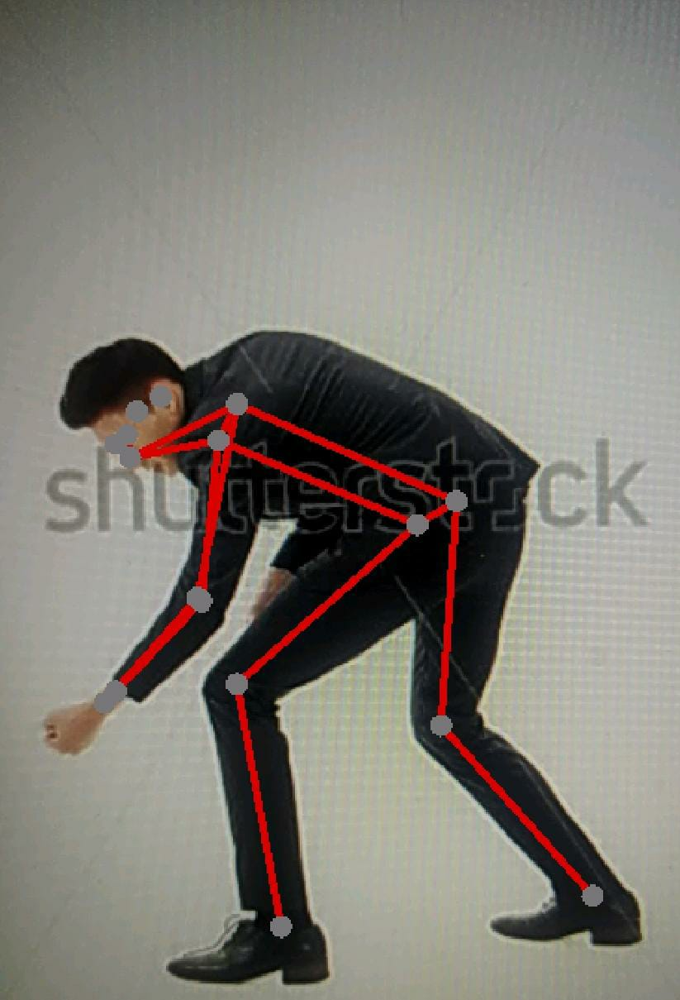

# TensorFlow Lite Application "Renault Pose Detector" '

### Overview
Renault Pose Detector is an innovative mobile application designed to enhance the safety and efficiency of workers in the automotive industry. Our application utilizes technology powered by Kotlin and TensorFlow to accurately detect the postures of workers performing tasks on cars. By leveraging machine learning algorithms, our application can identify potential safety risks and assist workers in optimizing their posture for improved performance and reduced risk of injury.

The app demonstrates how to use 4 models:

* Single pose models: The model can estimate the pose of only one person in the
input image. If the input image contains multiple persons, the detection result
can be largely incorrect.
   * PoseNet
   * MoveNet Lightning
   * MoveNet Thunder
* Multi pose models: The model can estimate pose of multiple persons in the
input image.
   * MoveNet MultiPose: Support up to 6 persons.

### Model used
Downloading, extraction and placement in assets folder has been managed
 automatically by `download.gradle`.

If you explicitly want to download the model, you can download it from here:

* [Posenet](https://storage.googleapis.com/download.tensorflow.org/models/tflite/posenet_mobilenet_v1_100_257x257_multi_kpt_stripped.tflite)
* [Movenet Lightning](https://tfhub.dev/google/movenet/singlepose/lightning/)
* [Movenet Thunder](https://tfhub.dev/google/movenet/singlepose/thunder/)
* [Movenet MultiPose](https://tfhub.dev/google/movenet/multipose/lightning/)

### More Informations

https://drive.google.com/file/d/1INqwsnHRC6FjIYdCUBKMLidJ-oVo2ITo/view?usp=sharing